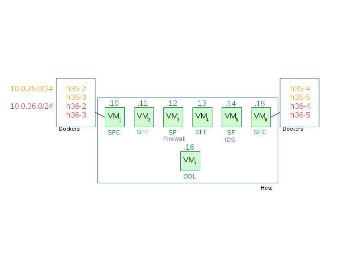

# Security Agent Demo

To launch the virtual machines, a VagrantFile has been written in [Common](Common/).

The demo has to be started in 6 steps :

1. Start the VMs
2. Install the VMs according to function (SFC/SFF/SF)
3. Configure the VMs
4. Configure the SDN controller
5. Test that the demo is working
6. Clean the demo

## Topology



## Steps

### Starting the VMs

You may change the number of VMs you wish to start by changing `NUM_NODES` in the [VagrantFile](Common/VagrantFile).

```
cd Common
vagrant up
```

### Installing the VMs

Execute the script `install.sh` of the function folder you wish to install for each VM :

```
ssh root@192.168.33.10 /vagrant/SFC/install.sh
ssh root@192.168.33.11 /vagrant/SFF/install.sh
ssh root@192.168.33.12 /vagrant/SF/install.sh
ssh root@192.168.33.13 /vagrant/SFF/install.sh
ssh root@192.168.33.14 /vagrant/SF/install.sh
ssh root@192.168.33.15 /vagrant/SFC/install.sh
ssh root@192.168.33.16 /vagrant/ODL-Controller/install.sh
```

### Configuring the VMs

Use the `config.sh` scripts :

```
ssh root@192.168.33.10 /vagrant/SFC/config.sh --controller=192.168.33.16 --bridge=sw1 --datapath-id=1
ssh root@192.168.33.11 /vagrant/SFF/config.sh 192.168.33.16
ssh root@192.168.33.12 /vagrant/SF/config.sh sw3
ssh root@192.168.33.13 /vagrant/SFF/config.sh 192.168.33.16
ssh root@192.168.33.14 /vagrant/SF/config.sh sw5
ssh root@192.168.33.15 /vagrant/SFC/config.sh --controller=192.168.33.16 --bridge=sw6 --datapath-id=6

ssh root@192.168.33.10 /vagrant/SFC/add-cont.sh --name=h35-2 --ip 10.0.35.2/24 --mac=00:00:00:00:35:02 --broadcast=10.0.35.255 --router-ip=10.0.35.1 --switch=sw1
ssh root@192.168.33.10 /vagrant/SFC/add-cont.sh --name=h35-3 --ip 10.0.35.3/24 --mac=00:00:00:00:35:03 --broadcast=10.0.35.255 --router-ip=10.0.35.1 --switch=sw1
ssh root@192.168.33.15 /vagrant/SFC/add-cont.sh --name=h35-4 --ip 10.0.35.4/24 --mac=00:00:00:00:35:04 --broadcast=10.0.35.255 --router-ip=10.0.35.1 --switch=sw6
ssh root@192.168.33.15 /vagrant/SFC/add-cont.sh --name=h35-5 --ip 10.0.35.5/24 --mac=00:00:00:00:35:05 --broadcast=10.0.35.255 --router-ip=10.0.35.1 --switch=sw6

ssh root@192.168.33.10 /vagrant/SFC/add-cont.sh --name=h36-2 --ip 10.0.36.2/24 --mac=00:00:00:00:36:02 --broadcast=10.0.36.255 --router-ip=10.0.36.1 --switch=sw1
ssh root@192.168.33.10 /vagrant/SFC/add-cont.sh --name=h36-3 --ip 10.0.36.3/24 --mac=00:00:00:00:36:03 --broadcast=10.0.36.255 --router-ip=10.0.36.1 --switch=sw1
ssh root@192.168.33.15 /vagrant/SFC/add-cont.sh --name=h36-4 --ip 10.0.36.4/24 --mac=00:00:00:00:36:04 --broadcast=10.0.36.255 --router-ip=10.0.36.1 --switch=sw6
ssh root@192.168.33.15 /vagrant/SFC/add-cont.sh --name=h36-5 --ip 10.0.36.5/24 --mac=00:00:00:00:36:05 --broadcast=10.0.36.255 --router-ip=10.0.36.1 --switch=sw6

ssh root@192.168.33.12 /vagrant/SF/set-flows.sh sw3 192.168.33.11
ssh root@192.168.33.14 /vagrant/SF/set-flows.sh sw5 192.168.33.13
```

### Configuring the SDN Controller

```
ssh root@192.168.33.16 /vagrant/ODL-Controller/config.sh
ssh root@192.168.33.16 /vagrant/ODL-Controller/config-sf.sh 127.0.0.1
```

### Test the demo

#### Ping test

```
ssh root@192.168.33.10
cloud1# docker attach h35-2
h35-2# ping 10.0.36.4
**SHOULD WORK**
# Detach from docker using <Ctrl + P> <Ctrl + Q>
cloud1# exit
```

#### HTTP test

```
ssh root@192.168.33.15
cloud6# docker attach h36-4
h36-4# python -m SimpleHTTPServer 80
<Ctrl-P><Ctrl-Q>
cloud6# exit
ssh root@192.168.33.10
cloud1# docker attach h35-2
h35-2# curl http://10.0.36.4
**SHOUD RETURN THE FOLDERS IN / OF h36-4**
# Detach from docker using <Ctrl + P> <Ctrl + Q>
cloud1# exit
```

### Clean up demonstration

```
ssh root@192.168.33.16 "/root/distribution-karaf-0.5.2-Boron-SR2/bin/client 'shutdown -f -h -cc 0'"

ssh root@192.168.33.10 /vagrant/SFC/del-cont.sh --name=h35-2 --switch=sw1
ssh root@192.168.33.10 /vagrant/SFC/del-cont.sh --name=h35-3 --switch=sw1
ssh root@192.168.33.15 /vagrant/SFC/del-cont.sh --name=h35-4 --switch=sw6
ssh root@192.168.33.15 /vagrant/SFC/del-cont.sh --name=h35-5 --switch=sw6
ssh root@192.168.33.10 /vagrant/SFC/del-cont.sh --name=h36-2 --switch=sw1
ssh root@192.168.33.10 /vagrant/SFC/del-cont.sh --name=h36-3 --switch=sw1
ssh root@192.168.33.15 /vagrant/SFC/del-cont.sh --name=h36-4 --switch=sw6
ssh root@192.168.33.15 /vagrant/SFC/del-cont.sh --name=h36-5 --switch=sw6

ssh root@192.168.33.10 "ovs-vsctl del-br sw1; ovs-vsctl del-manager;"
ssh root@192.168.33.11 "ovs-vsctl del-br sw2; ovs-vsctl del-manager;" 
ssh root@192.168.33.12 "ovs-vsctl del-br sw3;" 
ssh root@192.168.33.13 "ovs-vsctl del-br sw4; ovs-vsctl del-manager;" 
ssh root@192.168.33.14 "ovs-vsctl del-br sw5;" 
ssh root@192.168.33.15 "ovs-vsctl del-br sw6; ovs-vsctl del-manager;" 
```

### Misc

In order to deploy the infrastructure faster, the build folder has been created with the precompiled versions of softwares (the cloud-sec plugin, a pre-build Opendaylight, openvswitch and a fixed version of groupbasedpolicy plugin for ODL).

It then has the following files : (not included in the repo to save space)

```
drwxr-xr-x 10 mrousse mrousse      4096 mai   15 17:01 cloudsec
-rw-r--r--  1 mrousse mrousse 424238009 mai   11 16:58 distribution-karaf-0.5.2-Boron-SR2.tar.gz
-rw-r--r--  1 mrousse mrousse   2308958 mai   15 15:35 groupbasedpolicy-0.4.2-Boron-SR2.jar
-rw-r--r--  1 mrousse mrousse   6706247 mai   15 15:35 groupbasedpolicy-0.4.2-Boron-SR2-javadoc.jar
-rw-r--r--  1 mrousse mrousse   1337928 mai   15 15:35 groupbasedpolicy-0.4.2-Boron-SR2-sources.jar
-rw-r--r--  1 mrousse mrousse    147463 mai   15 15:35 groupbasedpolicy-0.4.2-Boron-SR2-tests.jar
-rw-r--r--  1 mrousse mrousse    656498 mai   15 13:29 openvswitch-common_2.5.90-1_amd64.deb
-rw-r--r--  1 mrousse mrousse   3211726 mai   15 13:29 openvswitch-datapath-dkms_2.5.90-1_all.deb
-rw-r--r--  1 mrousse mrousse   4831428 mai   15 13:29 openvswitch-datapath-source_2.5.90-1_all.deb
-rw-r--r--  1 mrousse mrousse   7357868 mai   15 13:29 openvswitch-dbg_2.5.90-1_amd64.deb
-rw-r--r--  1 mrousse mrousse     39650 mai   15 13:29 openvswitch-ipsec_2.5.90-1_amd64.deb
-rw-r--r--  1 mrousse mrousse     33488 mai   15 13:29 openvswitch-pki_2.5.90-1_all.deb
-rw-r--r--  1 mrousse mrousse   1190312 mai   15 13:29 openvswitch-switch_2.5.90-1_amd64.deb
-rw-r--r--  1 mrousse mrousse     49230 mai   15 13:29 openvswitch-test_2.5.90-1_all.deb
-rw-r--r--  1 mrousse mrousse    444654 mai   15 13:29 openvswitch-testcontroller_2.5.90-1_amd64.deb
-rw-r--r--  1 mrousse mrousse    212092 mai   15 13:29 openvswitch-vtep_2.5.90-1_amd64.deb
-rw-r--r--  1 mrousse mrousse    192498 mai   15 13:29 ovn-central_2.5.90-1_amd64.deb
-rw-r--r--  1 mrousse mrousse    271436 mai   15 13:29 ovn-common_2.5.90-1_amd64.deb
-rw-r--r--  1 mrousse mrousse     37244 mai   15 13:29 ovn-docker_2.5.90-1_amd64.deb
-rw-r--r--  1 mrousse mrousse    529870 mai   15 13:29 ovn-host_2.5.90-1_amd64.deb
-rw-r--r--  1 mrousse mrousse     85716 mai   15 13:29 python-openvswitch_2.5.90-1_all.deb
```
